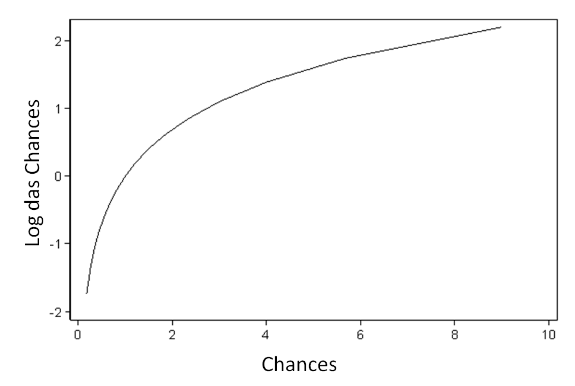

```{r setup, include=FALSE}
options(scipen = 999)
knitr::opts_chunk$set(echo = FALSE)
knitr::knit_hooks$set(
   error = function(x, options) {
     paste('\n\n<div class="alert alert-danger">',
           gsub('##', '\n', gsub('^##\ Error', '**Error**', x)),
           '</div>', sep = '\n')
   },
   warning = function(x, options) {
     paste('\n\n<div class="alert alert-warning">',
           gsub('##', '\n', gsub('^##\ Warning:', '**Warning**', x)),
           '</div>', sep = '\n')
   },
   message = function(x, options) {
     paste('\n\n<div class="alert alert-info">',
           gsub('##', '\n', x),
           '</div>', sep = '\n')
   }
)
```

```{r meta, echo=FALSE, warning=FALSE}
library(metathis)
meta() %>%
  meta_general(
    description = "como interpretar a razão de chances na regressão logística." ) %>%
  meta_description("como interpretar a razão de chances na regressão logística.") %>% 
  meta_social(
    title = "como interpretar a razão de chances na regressão logística",
    url = "https://dataunirio.github.io/",
    og_type = "website",
    og_author = "DATAUNIRIO",
    twitter_creator = "@RJengajado"
  ) 
```


```{css, echo=FALSE}
  @import url('https://fonts.googleapis.com/css?family=Lobster&display=swap');
  @import url('https://fonts.googleapis.com/css?family=Chilanka&display=swap');
@import url('https://fonts.googleapis.com/css?family=Roboto&display=swap');


h1,h2,h3,h4,h5,h6 {
  color: #116155;
  #font-family: 'Great Vibes', cursive;
   font-family: 'Roboto', sans-serif;
   font-family: 'Roboto Condensed', sans-serif;
}
  body {
    font-family: 'Roboto', sans-serif;
    font-family: 'Roboto Condensed',
    font-size: 22px;
    color: #198c7b;
    background-color: #f7f5de;
  }
#  p::first-letter {
#    font-size: 200%;
#    color: #116155;
#    line-height: 70px;
#  }


```


```{r}
message('Essa é uma tradução. O original pode ser encontrado aqui. [https://stats.idre.ucla.edu/other/mult-pkg/faq/general/faq-how-do-i-interpret-odds-ratios-in-logistic-regression/](https://stats.idre.ucla.edu/other/mult-pkg/faq/general/faq-how-do-i-interpret-odds-ratios-in-logistic-regression/)')

```

## Introdução

Quando uma variável dependente binária é modelada usando a regressão logística, supõe-se que a transformação logit da variável resposta tenha uma relação linear com as variáveis preditoras. Isso torna a interpretação dos coeficientes de regressão um tanto complicada. Examinaremos o conceito de razão de chances (odds ratios) e vamos interpretar os resultados da regressão logística usando o conceito de razão de chances em alguns exemplos.

Este exemplo é adaptado de Pedhazur (1997). Suponha que sete em cada dez homens sejam admitidos em uma escola de engenharia, enquanto três em cada dez mulheres sejam admitidos. As probabilidades de admitir um homem são:

p = 7/10 = 0,7 

q = 1 – 0,7 = 0,3


Se você é homem, a probabilidade de ser admitido é 0,7 e a probabilidade de não ser admitido é 0,3.

Aqui estão as mesmas probabilidades para mulheres,

p = 3/10 = 0,3 q = 1 - 0,3 = 0,7

Se você é mulher, é exatamente o oposto, a probabilidade de ser admitido é de 0,3 e a probabilidade de não ser admitido é de 0,7. Agora podemos usar as probabilidades para calcular as chances (odds) de admissão para homens e mulheres,

odds(homens) = 0,7 / 0,3 = 2,33333 
odds(mulheres) = 0,3 / 0,7 = 0,42857

Em seguida, calculamos a razão de chances para admissão,

Razão de Chances = OR = 2,3333/0,42857 = 5,44

Assim, para um homem, as chances de ser admitido são 5,44 vezes maiores que as chances de uma mulher ser admitida.

### Da probabilidade às chances ao log das chances

Tudo começa com o conceito de probabilidade. Digamos que a probabilidade de sucesso de algum evento seja 0,8. Então a probabilidade de falha é 1 - 0,8 = 0,2. As chances de sucesso são definidas como a razão entre a probabilidade de sucesso e a probabilidade de falha. No nosso exemplo, as chances de sucesso são 0,8 / 0,2 = 4, ou seja, as chances de sucesso são de 4 a 1. 

Se a probabilidade de sucesso for de 0,5, ou seja, 50% para sucesso e 50% para fracasso, então as chances de sucesso são de 1 para 1.

A transformação de probabilidade em chances é uma transformação monotônica, significando que as chances aumentam à medida que a probabilidade aumenta ou vice-versa. A probabilidade varia de 0 e 1. As chances variam de 0 e infinito positivo. Abaixo está uma tabela da transformação de probabilidade em chances e também plotamos para o intervalo de p menor ou igual a 0,9.


```{r, warning=FALSE}
probabilidade<-c(.001,.01,.15,.2,.25,.3,.35,.4,.45,.5,.55,.6,.65,.7,.75,.8,.85,.9,.999,.9999)
chance<-c()
for(i in 1:20){
  chance[i]<-probabilidade[i]/(1-probabilidade[i])
}

exemplo<-data.frame(probabilidade,chance)
library(DT)
datatable(exemplo)


```


A transformação das chances em log das chances é a transformação pelo logaritmo neperiano. Novamente, esta é uma transformação monotônica. Ou seja, quanto maiores as chances, maior o log das chances e vice-versa. A tabela abaixo mostra a relação entre probabilidade, chances e log das chances. Também mostramos o gráfico de chances e log das chances.

```{r}
exemplo$log_chances<-log(exemplo$chance)
datatable(exemplo)
```




**Por que nos esforçamos ao fazer a transformação de probabilidade em log da chance?** Uma razão é que geralmente é difícil modelar uma variável que tenha um alcance restrito, como a probabilidade. Essa transformação é uma tentativa de contornar o problema de intervalo restrito. Ele mapeia a probabilidade variando entre 0 e 1 para registrar probabilidades que variam do infinito negativo ao infinito positivo. Outra razão é que, entre todas as infinitas opções de transformação, o log das chances é um dos mais fáceis de entender e interpretar. Essa transformação é chamada transformação de logit. 

Um modelo de regressão logística permite estabelecer uma relação entre uma variável de resultado binário e um grupo de variáveis preditoras. Ele modela a probabilidade transformada em logit como uma relação linear com as variáveis preditoras. Mais formalmente, seja Y a variável de resultado binário que indica falha/sucesso com {0,1} e p seja a probabilidade de y ser 1, isto é,

$p=P(Y=1)$,


Seja x_1, ⋯, x_k um conjunto de variáveis preditoras. Então a regressão logística de Y em x1, ⋯, xk estima valores de parâmetros para β0, β1, ⋯, βk através do método de máxima verossimilhança da seguinte equação

$$logit(p) = log(\frac{p}{1-p}) = \beta_0 + \beta_1 x_1 + \cdots + \beta_k x_k.$$

Faça o Exponencial e tome o inverso multiplicativo de ambos os lados,

$$\frac{1-p}{p} = \frac{1}{exp(\beta_0 + \beta_1 x_1 + \cdots + \beta_k x_k)}.$$

Divida parcialmente a fração no lado esquerdo da equação e adicione uma a ambos os lados,

$$\frac{1}{p} = 1 + \frac{1}{exp(\beta_0 + \beta_1 x_1 + \cdots + \beta_k x_k)}.$$

Mude 1 para um denominador comum,

$$\frac{1}{p} = \frac{exp(\beta_0 + \beta_1 x_1 + \cdots + \beta_k x_k)+1}{exp(\beta_0 + \beta_1 x_1 + \cdots + \beta_k x_k)}.$$

Finalmente, tome o inverso multiplicativo novamente para obter a fórmula da probabilidade $P(Y=1)$,

$$ {p} = \frac{exp(\beta_0 + \beta_1 x_1 + \cdots + \beta_k x_k)}{1+exp(\beta_0 + \beta_1 x_1 + \cdots + \beta_k x_k)} $$

Agora vamos rodar alguns modelos de regressões logísticas. Usaremos um conjunto de dados do site do UCLA:  Statistical Consulting Group, [https://stats.idre.ucla.edu/wp-content/uploads/2016/02/sample.csv](https://stats.idre.ucla.edu/wp-content/uploads/2016/02/sample.csv), para fins de ilustração. 

O conjunto de dados possui 200 observações e a variável de resultado usada será especial, indicando se um aluno está ou não em uma classe especial. Então nosso p = prob(especial = 1). Ignoraremos propositadamente todos os testes de significância e focaremos no significado dos coeficientes de regressão. 

##### Regressão logística sem variáveis preditoras

Vamos começar com a regressão logística mais simples, um modelo sem nenhuma variável preditora. Em uma equação, estamos modelando

logit(p) = β0

```{r,echo = TRUE}
#dados<-read.csv('https://stats.idre.ucla.edu/wp-content/uploads/2016/02/sample.csv')

dados<-read.csv('data/sample.csv')
colnames(dados)[5]<-"especial"

modelo<-glm(especial ~ 1,family =binomial(link = "logit"), data=dados)

modelo

```

Isto siginifica que $$ log(p/(1-p)) = -1,12546$$ .O que é o p aqui? neste exemplo, o p é a probabilidade do aluno ser de uma classe especial. vamos dar uma olhada na freqûencia:

```{r,echo = TRUE}
table(dados$especial)

prop.table(table(dados$especial))*100
```

Então p = 49/200 = 0,245. As chances são 0,245/(1-0,245) = 0,3245 e o log das chances (logit) é log(0,3245) = -1,12546. Em outras palavras, o intercepto do modelo sem variáveis preditivas é a estimativa do log das chances de estar na classe especial para a população de interesse. 

Também podemos transformar o log das chances em uma probabilidade: p = exp(-1,12546)/(1 + exp(-1,12546)) = 0,245.

## Regressão logística com uma única variável preditora dicotômica (binária)

Agora vamos dar um passo além, adicionando uma variável preditora binária, sexo, ao modelo. Essa é uma variável categórica que assume dois valores (1 = feminino e 0 = masculino).

Escrevendo-o em uma equação, o modelo descreve o seguinte relacionamento linear.

$$ logit(p) = β0 + β1 * feminino $$

```{r,echo = TRUE}

modelo1<-glm(especial ~ female,family =binomial(link = "logit"), data=dados)

modelo1
```

Antes de tentar interpretar os dois parâmetros estimados acima, vamos dar uma olhada na tabela  cruzada da variável especial com female.


```{r,echo = TRUE}
tabela<-table(dados$female,dados$especial)
colnames(tabela)<-c("Não","Sim")
rownames(tabela)<-c("Masculino","Feminino")
tabela
```

Em nosso conjunto de dados, quais são as chances de um homem na classe especial e quais são as chances de uma mulher na classe especial?

Podemos calcular manualmente essas chances a partir da tabela: para homens, as chances de pertencer à classe especial são (17/91)/(74/91) = 17/74 = 0,23; e para as mulheres, as chances de pertencer à classe especial são (32/109)/(77/109) = 32/77 = 0,42. 

A razão entre as chances femininas e masculinas é (32/77)/(17/74) = (32 * 74)/(77 * 17) = 1,809. 

Portanto, as chances para os homens são de 17 para 74, as chances para as mulheres são de 32 para 77, 

**As chances para as mulheres são cerca de 81% maiores que as chances para os homens.**

Agora podemos relacionar as chances de homens e mulheres e cos os resultados da regressão logística. O intercepto de -1,471 é o log de chances para os homens, pois o sexo masculino é o grupo de referência (masculino = 0). Usando as probabilidades que calculamos acima para os homens, podemos confirmar isso: log(0,23) = -1,47. O coeficiente para mulheres é o log da razão de chances entre o grupo feminino e o masculino: log(1,809) = 0,593. 

Mas não queremos o log da razão de chances. queremos a razão de chances! 

Assim, podemos obter a razão de chances fazendo o exponencial do coeficiente para as mulheres. 

```{r,echo = TRUE}

razao_chances<-exp(modelo1$coefficients[2])
razao_chances

```

## Regressão logística com uma única variável preditora contínua

Outro exemplo simples é um modelo com uma única variável preditora contínua, como o modelo abaixo. Ele descreve a relação entre as notas de matemática dos alunos e as chances de estar em uma classe especial.

$$ logit(p) = β0 + β1*math $$

```{r,echo = TRUE}

modelo2<-glm(especial ~ math,family =binomial(link = "logit"), data=dados)

modelo2
```
Nesse caso, o coeficiente estimado para o intercepto é o log da razão de chances de estar em uma classe especial para um aluno com uma nota zero em matemática. 

Em outras palavras, as chances de pertencer a uma classe especial quando a pontuação em matemática é zero são exp(-9,793942) = 0,00005579. Essas chances são muito baixas, mas se observarmos a distribuição da variável matemática, veremos que ninguém na amostra possui uma pontuação matemática menor que 30. De fato, todas as pontuações de teste no conjunto de dados foram padronizadas em torno da média de 50 e desvio padrão de 10. Portanto, o intercepto nesse modelo corresponde às chances logarítmicas de estar em uma classe especial quando a matemática está no valor hipotético de zero.

Como interpretamos o coeficiente para matemática? As estimativas de coeficiente e intercepto nos dão a seguinte equação:

  $$  log(p/(1-p)) = logit(p) = - 9,793942 + 0,1563404*math $$

Vamos fixar a matemática em algum valor. Usaremos 54. Então o logit condicional de estar em uma classe especial quando a pontuação matemática é mantida em 54 é

  $$  log(p/(1-p))(math = 54) = - 9,793942 + 0,1563404 * 54 $$

Podemos examinar o efeito de um aumento de uma unidade na pontuação matemática. Quando a pontuação matemática é mantida em 55, o logit condicional de estar em uma classe de honra é

  $$  log (p/(1-p))(math = 55) = - 9,793942 + 0,1563404 * 55 $$

Tomando a diferença das duas equações, temos o seguinte:

  $$  log(p/(1-p))(math = 55) - log(p/(1-p))(math = 54) = 0,1563404 $$

Podemos dizer agora que o coeficiente de matemática é a diferença no log das chances. Em outras palavras, para um aumento de uma unidade na pontuação matemática, a mudança esperada no log das chances é 0,1563404.

Podemos traduzir essa alteração no log das chances para a alteração nas chances? De fato, nós podemos. Lembre-se de que o logaritmo converte multiplicação e divisão em adição e subtração.


Inversa, o exponencial converte adição e subtração em multiplicação e divisão. Se exponenciamos ambos os lados de nossa última equação, temos o seguinte:
$$
exp[log(p/(1-p))(math=55) / log(p/(1-p))(math=54)] =

exp(log(p/(1-p))(math=55)) / exp(log(p/(1-p))(math= 54)) = 

odds(math=55)/odds(math=54) = exp(0,1563404) = 1,1692241.
$$

Então, podemos dizer que, para um aumento de uma unidade na pontuação matemática, esperamos ver um aumento de cerca de 17% nas chances de participar de uma aula especial. 

Esse aumento de 17% não depende do valor em que a matemática é mantida. podemos passar de 54 para 55, ou passar de 67 para 68, ou ainda passar de 41 para 42.

## Regressão logística com múltiplas variáveis preditoras e sem termos de interação

Em geral, podemos ter várias variáveis preditoras em um modelo de regressão logística.


$$    logit(p) = log(p/(1-p))= β0 + β1*x1 + … + βk*xk  $$


Aplicando esse modelo ao nosso conjunto de dados, cada coeficiente estimado é a mudança esperada no log das chances em uma classe espacial para um aumento unitário na variável preditora correspondente, mantendo as outras variáveis preditivas constantes em determinado valor. 

Cada coeficiente exponencial é a razão de duas chances, ou a mudança nas probabilidades na escala multiplicativa para um aumento unitário na variável preditora correspondente, mantendo outras variáveis em determinado valor. Aqui está um exemplo.

$$    logit(p) = log(p/(1-p))= β0  + β1*math + β2*female + β3*read $$

```{r,echo = TRUE}

modelo2<-glm(especial ~ math+female+read,family =binomial(link = "logit"), data=dados)

modelo2
```

Esse modelo ajustado diz que, mantendo a matemática e a leitura em um valor fixo, as chances de ingressar em uma classe especial para mulheres (feminino = 1) sobre as chances de ingressar em uma classe honrosa para homens (feminino = 0) são exp(0,979948) = 2,66. Em termos de variação percentual, podemos dizer que as chances para as mulheres são 166% maiores que as chances para os homens. 

O coeficiente de matemática diz que, mantendo a variável feminino e a variável leitura constante (em um valor fixo), veremos um aumento de 13% nas chances de ingressar em uma classe especial por um aumento de uma unidade na nota em matemática. Isso acontece porque exp(0,1229589) = 1,13.

## Regressão logística com um termo de interação de duas variáveis preditoras

Em todos os exemplos anteriores, dissemos que o coeficiente de regressão de uma variável corresponde à mudança nas probabilidades logarítmicas e sua forma exponenciada corresponde à razão de chances. Isso só é verdade quando nosso modelo não possui termos de interação. Quando um modelo possui termos de interação de duas variáveis preditivas, ele tenta descrever como o efeito de uma variável preditora depende do nível / valor de outra variável preditora. A interpretação dos coeficientes de regressão se torna mais envolvida.

Vamos dar um exemplo.

  $$  logit(p) = log(p/(1-p))= β0 + β1*female + β2*math + β3*female*math $$
  
```{r,echo = TRUE}

modelo3<-glm(especial ~ math+female+math*female,family =binomial(link = "logit"), data=dados)

modelo3
```
  
Na presença do termo de interação entre as variáveis feminino e matemática, não podemos mais falar sobre o efeito feminino, mantendo todas as outras variáveis constantes em determinado valor, pois não faz sentido fixar matemática e feminino*matemática em determinado valor e ainda permitir a mudança da variável feminino de 0 para 1.

Neste exemplo, onde examinamos a interação de uma variável binária e uma variável contínua, podemos pensar que realmente temos duas equações: uma para homens e outra para mulheres. Para homens (mulheres = 0), a equação é simplesmente:

  $$  logit(p) = log(p/(1-p)) = β0 + β2 * math$$

Para as mulheres, a equação é

  $$  logit(p) = log(p/(1-p)) = (β0 + β1) + (β2 + β3) * math$$

Agora podemos mapear a saída da regressão logística para essas duas equações. Portanto, podemos dizer que o coeficiente para a matemática é o efeito da matemática quando feminino = 0. Mais explicitamente, podemos dizer que, para estudantes do sexo masculino, um aumento de uma unidade na pontuação da matemática gera uma alteração no log das chances de 0,13. Por outro lado, para as alunas, um aumento de uma unidade na pontuação de matemática gera uma alteração no log das chances de (0,13 + 0,067) = 0,197. Em termos de razão de chances, podemos dizer que, para estudantes do sexo masculino, a razão de chances é exp(0,13) = 1,14 para um aumento de uma unidade na pontuação matemática e a razão de chances para estudantes do sexo feminino é exp(0,197) = 1,22 para um aumento de uma unidade na pontuação matemática. A razão dessas duas razões de chances (feminino sobre masculino) acaba sendo o exponencial do coeficiente para o termo de interação feminino pela matemática: 1,22/1,14 = exp(0,067) = 1,07.


Fonte: Bruin, J. 2006. newtest: command to compute new test.  UCLA:  
Statistical Consulting Group. [https://stats.idre.ucla.edu/other/mult-pkg/faq/general/faq-how-do-i-interpret-odds-ratios-in-logistic-regression/](https://stats.idre.ucla.edu/other/mult-pkg/faq/general/faq-how-do-i-interpret-odds-ratios-in-logistic-regression/)